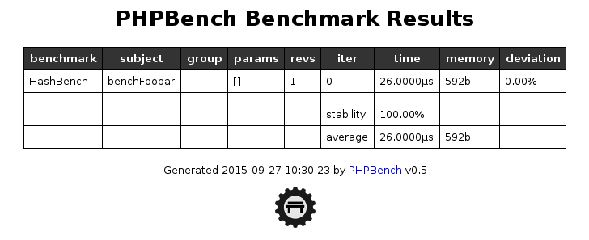

Benchmark Runner
================

The benchmark runner is a command line application which executes the
benchmarks and generates reports from the results.

Running Benchmarks
------------------

To run all benchmarks in a specific directory:

.. code-block:: bash

    $ phpbench run /path/to

To run a single benchmark class, specify a specific file:

.. code-block:: bash

    $ phpbench run /path/to/HashBench.php

To run a single method of a single benchmark class, use the ``--filter``
option:

.. code-block:: bash

    $ phpbench run /path/to/HashBench.php --filter=benchMd5

Groups can be specified using the ``--group`` option:

.. code-block:: bash

    $ phpbench run /path/to/HashBench.php --group=hash

.. note::

    Both ``--subject`` and ``--group`` options may be specified multiple
    times.

.. _filtering:

Filtering
---------

The ``--filter`` option accepts a regex without the delimiters and matches
against a string such as ``HashBench::benchMd5``, so all of the following are
valid:

.. code-block:: bash

    $ phpbench run /path/to --filter=benchFoo
    $ phpbench run /path/to --filter=HashBench::benchFoo
    $ phpbench run /path/to --filter=Hash.*

.. _overriding_iterations_and_revolutions:

Overriding Iterations and Revolutions
-------------------------------------

The benchmark runner can override the number of :ref:`revolutions
<revolutions>` and
:ref:`iterations <iterations>` which will be executed:

.. code-block:: bash

    $ phpbench run /path/to/HashBench.php --iterations=10 --revs=1000

Overriding the Bootstrap
------------------------

You can override or set the :ref:`configuration_bootstrap` using the
``--bootstrap`` option:

.. code-block:: bash

    $ phpbench run /path/to/HashBench.php --bootstrap=vendor/autoload.php

Generating Reports
------------------

By default PHPBench will run the benchmarks and tell you that the benchmarks
have been executed successfully. In order to see some useful information you
can specify that a report be generated.

By default there are two reports ``default`` and ``aggregate``, and they can
be specified directly using the ``--report`` option:

.. code-block:: bash

    $ phpbench run /path/to/HashBench.php --report=default

If you want to experiment with a new report configuration, you can also pass a
JSON encoded string with the generator options instead of the report name:

.. code-block:: bash

    $ phpbench run /path/to/HashBench.php --report='{"extends": "default", "exclude": ["benchmark", "subject"]}'

See the :doc:`report-generators` chapter for more information on how you can
configure reports.

The ``--report`` option can be specified multiple times.

.. note::

    If you want to suppress all other output and only show the output from the
    reports you can use the ``--quiet`` option. This is especially useful when
    piping a report to another program.

.. _retry_threshold:

Retry Threshold
---------------

PHPBench is able to dramatically improve the stability of your benchmarks by
retrying the iteration set until all the deviations in time between iterations
fit within a given margin of error.

You can set this as follows:

.. code-block:: bash

    $ phpbench run /path/to/HashBench.php --retry-threshold=5

The retry threshold is the margin of error as a percentage which is allowed
between deviations.  Generally the lower this value, the higher the stability,
but the longer it will take for a set of iterations to be resolved.

By default the retry threshold is disabled.

You may also set the retry threshold in the
:ref:`configuration <configuration_retry_threshold>`.

Changing the Output Medium
--------------------------

By default PHPBench will output the reports to the console using the
``console`` output. The output can be changed using the ``--output`` option.
For example, to render a HTML document:

.. code-block:: bash

    $ phpbench run /path/to/HashBench.php --report=default --output=html

Example of HTML output:

See the :doc:`report-renderers` chapter for more information.

Deffering Report Generation
---------------------------

You can dump the benchmarking results as an XML file and generate reports
separately.

Dump the benchmark results using the ``--dump-file`` option

.. code-block:: bash

    $ phpbench run /path/to/HashBench.php --dump-file=report.xml

You can then generate reports using the ``report`` command:

.. code-block:: bash

    $ phpbench report report.xml --report=default

Progress Reporters
------------------

By default PHPBench issues a single ``.`` for each benchmark subject executed.
This is the ``dots`` progress reporter. Different progress reporters can be
specified using the ``--progress`` option:

.. code-block:: bash

    $ phpbench run /path/to/HashBench.php --progress=classdots

The built-in progress loggers are:

- ``dots``: The default logger, shows one dot per subject (like PHPUnit).
- ``classdots``: Shows the benchmark class, and then a dot for each subject.
- ``verbose``: Verbose output (format `R<retry nb.> I<iter nb.> #<parameter set
  nb.>`).

Configuration File
------------------

A custom configuration file can be specified with the ``--config`` option.  See
the :doc:`configuration` chapter for more information on configuration.
