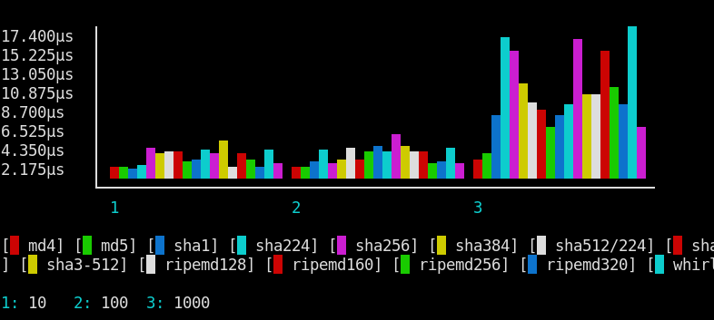

Hashing
=======

   Console Output

This hashing benchmark accepts two parameter sources: one for algorithms and the other
for the size of the string to hash.

Parameters from different providers are combined into a cartesian product,
meaning that each algorithm will be combined with each size.

.. codeimport:: ../../examples/Benchmark/Hashing/HashingBench.php
  :language: php
  :sections: all

You can configure a bar chart report grouping both by size and algorithm:

.. literalinclude:: ../../examples/Benchmark/Hashing/hashing_report.json
  :language: json

