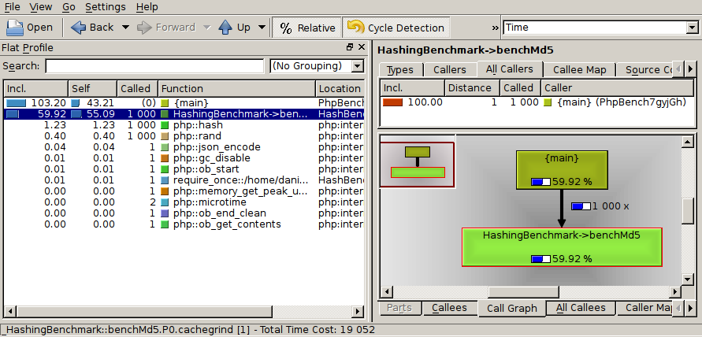

Xdebug
======

The Xdebug extension allows you to easily profile your code using
`function traces`_ or by generating cachegrind `profiles`_.

The commands are very similar to the standard ``run`` command with the
difference that only single iterations are performed.

.. note::

    Xdebug needs to be installed, however it does NOT need to be activated by
    default. PHPBench will automatically try and load and configure the
    extension even if it is disabled.

.. tip::

	You can use the Xdebug executors with the standard ``run`` command by
	specifying either ``xdebug_profile`` or ``xdebug_trace`` with the
	``--executor`` option.

Installation
------------

The Xdebug extension is bundled with PHPBench, it just needs to be activated:

.. code-block:: javascript

    {
       "extensions": [
           "PhpBench\\Extensions\\XDebug\\XDebugExtension"
       ]
    }

Alternatively you can activate it directly from the CLI using the
``extension`` option:

.. code-block:: php

    $ phpbench xdebug:profile examples/HashBench.php --extension="PhpBench\\Extensions\\XDebug\\XDebugExtension"

Function Tracing
----------------

Function tracing provides a simple way to profile your benchmark subjects:

.. code-block:: bash

    $ ./bin/phpbench xdebug:trace benchmarks/Micro/Math/StatisticsBench.php

    +-----+-------+----------+-----------+-----------+---------------------------------------+------------------------------------------------+
    | #   | Level | Mem      | Time      | Time inc. | Function                              | File                                           |
    +-----+-------+----------+-----------+-----------+---------------------------------------+------------------------------------------------+
    | 777 | 4     | 922,976b | 0.015284s | 192μs     | PhpBench\Math\Statistics::stdev()     | ./benchmarks/Micro/Math/StatisticsBench.php:40 |
    | 778 | 5     | 923,024b | 0.015294s | 168μs     |  PhpBench\Math\Statistics::variance() | ./lib/Math/Statistics.php:29                   |
    | 779 | 6     | 923,024b | 0.015304s | 34μs      |   PhpBench\Math\Statistics::mean()    | ./lib/Math/Statistics.php:44                   |
    | 780 | 7     | 923,072b | 0.015313s | 9μs       |    array_sum()                        | ./lib/Math/Statistics.php:73                   |
    | 781 | 7     | 923,120b | 0.015326s | 8μs       |    count()                            | ./lib/Math/Statistics.php:79                   |
    +-----+-------+----------+-----------+-----------+---------------------------------------+------------------------------------------------+

You can enable showing arguments using the ``--show-args`` option:

.. code-block:: bash

    $ ./bin/phpbench xdebug:trace benchmarks/Micro/Math/StatisticsBench.php --show-args
    +-----+-------+----------+-----------+-----------+----------------------------------------------------------------------------------+------------------------------------------------+
    | #   | Level | Mem      | Time      | Time inc. | Function                                                                         | File                                           |
    +-----+-------+----------+-----------+-----------+----------------------------------------------------------------------------------+------------------------------------------------+
    | 777 | 4     | 922,912b | 0.021977s | 244μs     | PhpBench\Math\Statistics::variance(                                              | ./benchmarks/Micro/Math/StatisticsBench.php:33 |
    |     |       |          |           |           |  array (0 => 10, 1 => 100, 2 => 42, 3 => 84, 4 => 11, 5 => 12, 6 => 9, 7 => 6)   |                                                |
    |     |       |          |           |           |  ???                                                                             |                                                |
    |     |       |          |           |           | )                                                                                |                                                |
    | 778 | 5     | 922,960b | 0.021992s | 49μs      |  PhpBench\Math\Statistics::mean(                                                 | ./lib/Math/Statistics.php:44                   |
    |     |       |          |           |           |   array (0 => 10, 1 => 100, 2 => 42, 3 => 84, 4 => 11, 5 => 12, 6 => 9, 7 => 6)  |                                                |
    |     |       |          |           |           |  )                                                                               |                                                |
    | 779 | 6     | 923,008b | 0.022005s | 13μs      |   array_sum(                                                                     | ./lib/Math/Statistics.php:73                   |
    |     |       |          |           |           |    array (0 => 10, 1 => 100, 2 => 42, 3 => 84, 4 => 11, 5 => 12, 6 => 9, 7 => 6) |                                                |
    |     |       |          |           |           |   )                                                                              |                                                |
    | 780 | 6     | 923,056b | 0.022024s | 11μs      |   count(                                                                         | ./lib/Math/Statistics.php:79                   |
    |     |       |          |           |           |    array (0 => 10, 1 => 100, 2 => 42, 3 => 84, 4 => 11, 5 => 12, 6 => 9, 7 => 6) |                                                |
    |     |       |          |           |           |   )                                                                              |                                                |
    +-----+-------+----------+-----------+-----------+-----------------------------------------------------------------------------------+------------------------------------------------+

Profiling (cachegrind)
----------------------

The profile command is very similar to the run command:

.. code-block:: bash

    $ phpbench xdebug:profile examples/HashBench.php --progress=none

    3 profile(s) generated:

        profile/_HashingBenchmark::benchMd5.P0.cachegrind
        profile/_HashingBenchmark::benchSha1.P0.cachegrind
        profile/_HashingBenchmark::benchSha256.P0.cachegrind

A single profile is generated for each subject in the benchmark and placed in
the directory ``profile`` by default.

The generated profiles can be viewed with a cachegrind viewer such as
`kcachgrind` (linux) or `webgrind`_ (web based).

It is possible to automatically launch a GUI for each of the profiles using
the ``--gui`` option. By default PHPBench will attempt to locate the
``kcachegrind`` executable. If you do not have ``kcachegrind`` you can specify
a different executable using the ``--gui-bin`` option.

.. _profiles: http://xdebug.org/docs/profiler
.. _function traces: https://xdebug.org/docs/execution_trace
.. _kcachegrind: http://kcachegrind.sourceforge.net/html/Home.html
.. _webgrind: https://github.com/jokkedk/webgrind
