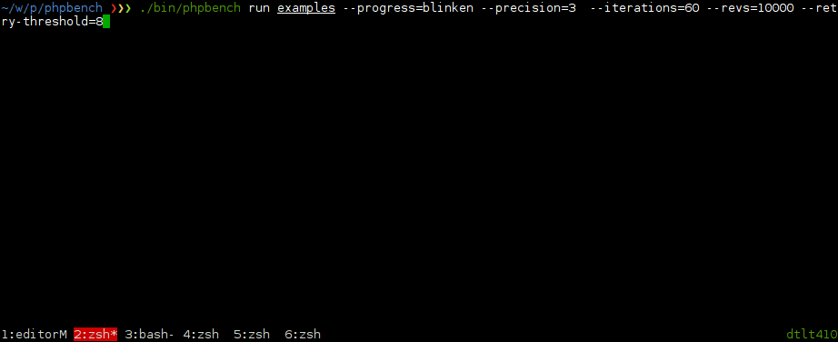

Benchmark Runner
================

The benchmark runner is a command line application which executes the
benchmarks and generates reports from the results.

Running Benchmarks
------------------

To run all benchmarks in a specific directory:

.. code-block:: bash

    $ phpbench run /path/to

To run a single benchmark class, specify a specific file:

.. code-block:: bash

    $ phpbench run /path/to/HashBench.php

To run a single method of a single benchmark class, use the ``--filter``
option:

.. code-block:: bash

    $ phpbench run /path/to/HashBench.php --filter=benchMd5

Groups can be specified using the ``--group`` option:

.. code-block:: bash

    $ phpbench run /path/to/HashBench.php --group=hash

.. note::

    Both ``--subject`` and ``--group`` options may be specified multiple
    times.

.. _filtering:

Filtering
---------

The ``--filter`` option accepts a regex without the delimiters and matches
against a string such as ``HashBench::benchMd5``, so all of the following are
valid:

.. code-block:: bash

    $ phpbench run /path/to --filter=benchFoo
    $ phpbench run /path/to --filter=HashBench::benchFoo
    $ phpbench run /path/to --filter=Hash.*

In addition the ``--variant`` option allows you to filter by a specific
parameter set name:

.. code-block:: bash

    $ phpbench run /path/to --filter=Hash.* --variant=md5

.. _overriding_iterations_and_revolutions:

Overriding Iterations and Revolutions
-------------------------------------

The benchmark runner can override the number of :ref:`revolutions
<metadata_revolutions>` and
:ref:`iterations <metadata_iterations>` which will be executed:

.. code-block:: bash

    $ phpbench run /path/to/HashBench.php --iterations=10 --revs=1000

You may specify these options multiple times.

Overriding the Bootstrap
------------------------

You can override or set the :ref:`configuration_runner_bootstrap` using the
``--bootstrap`` option:

.. code-block:: bash

    $ phpbench run /path/to/HashBench.php --bootstrap=vendor/autoload.php

Assertions: Overriding and Toleration
-------------------------------------

Use the ``--assert`` option to introduce or override assertions:

.. code-block:: bash

    $ phpbench run /path/to/HashBench.php --assert="variant.mode <= 10 microsconds +/- 10%"

This will assert that ALL variants must have a mode less than 10. For more
information on assertions see :doc:`assertions`.

Failing assertions will cause PHPBench to exit with code ``2``. If you want to
tolerate failures (f.e. in an unstable CI environment) you can use the
``--tolerate-failure`` option.

For more information about assertions see :doc:`assertions`.

Generating Reports
------------------

By default PHPBench will run the benchmarks and tell you that the benchmarks
have been executed successfully. In order to see some useful information you
can specify that a report be generated.

By default there are two reports ``default`` and ``aggregate``, and they can
be specified directly using the ``--report`` option:

.. code-block:: bash

    $ phpbench run /path/to/HashBench.php --report=default

See the :doc:`reports` guide for more information on how you can
configure reports.

.. note::

    If you want to suppress all other output and only show the output from the
    reports you can use the ``--progress=none`` option. This is especially useful when
    piping a report to another program.

.. _retry_threshold:

Retry Threshold
---------------

PHPBench is able to significantly improve the stability of your benchmarks by
retrying the iteration set until all the deviations in time between iterations
fit within a given margin of error.

You can set this as follows:

.. code-block:: bash

    $ phpbench run /path/to/HashBench.php --retry-threshold=5

The retry threshold is the margin of error as a percentage which is allowed
between deviations.  Generally the lower this value, the higher the stability,
but the longer it will take for a set of iterations to be resolved.

By default the retry threshold is disabled.

You may also set the retry threshold in the
:ref:`configuration <configuration_runner_retry_threshold>`.

Changing the Output Format
--------------------------

By default PHPBench will output the reports to the console using the
``console`` output. The output can be changed using the ``--output`` option.
For example, to render a HTML document:

.. code-block:: bash

    $ phpbench run /path/to/HashBench.php --report=default --output=delimited

See the :doc:`../report-renderers` reference for more information.

Storing Results
---------------

You can store benchmark results locally:

.. code-block:: bash

    $ phpbench run /path/to/HashBench.php --tag=foobar

Then generate reports:

.. code-block:: bash

    $ phpbench report --ref=foobar --report=aggregate

To dump the benchmark results to an XML file use the ``--dump-file`` option:

.. code-block:: bash

    $ phpbench run /path/to/HashBench.php --dump-file=report.xml

Then generate reports:

.. code-block:: bash

    $ phpbench report --file=report.xml --report=default

Progress Reporters
------------------

By default PHPBench issues a single ``.`` for each benchmark subject executed.
This is the ``dots`` progress reporter. Different progress reporters can be
specified using the ``--progress`` option:

   blinken progress logger.

.. code-block:: bash

    $ phpbench run /path/to/HashBench.php --progress=classdots

The built-in progress loggers are:

- ``verbose``: The default logger, format: `[R<retry nb.>] I<iter nb.> P<parameter set nb.> <mean|mode per rev.> <standard deviation per rev.> <relative standard deviation per rev.>` ).
- ``plain``: Similar to verbose, but without any animation, useful for CI environments.
- ``dots``: Shows one dot per subject (like PHPUnit).
- ``classdots``: Shows the benchmark class, and then a dot for each subject.
- ``blinken``: Highly visual progress logger.
- ``histogram``: Shows a histogram with 8 vertical levels and 16 bins for each
  iteration set.

All of the progress reports contain the following footer:

.. code-block:: bash

    3 subjects, 30 iterations, 30000 revs, 0 rejects
    min [mean mode] max: 0.84 [1.13 1.12] 1.66 (μs/r)
    ⅀T: 33987μs μSD/r 0.16μs μRSD/r: 14.92%

It provides a summary of the minimum, mean, mode, and maximum subject times, given
microseconds per revolution. ⅀T is the aggregate total time, μSD/r is the mean
standard deviation, and μRSD/r is the mean relative standard deviation.

.. warning::

    These summary statistics can be misleading. You should always verify the
    individual subject statistics before drawing any conclusions.

Configuration File
------------------

A custom configuration file can be specified with the ``--config`` option.  See
the :doc:`../configuration` reference for more information on configuration.

Exit codes
----------

The following exit codes can occur:

- ``0``: Everything was fine.
- ``1``: Errors encountered in benchmarks.
- ``2``: Assertion failures.
- ``255``: Internal error
