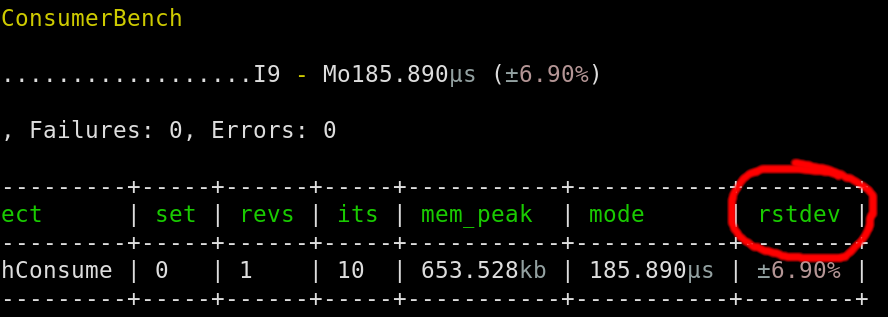

Quick Start
===========

This tutorial will walk you through creating a simple project that
uses PHPBench as a dependency.

Create your project
-------------------

Create a directory for the tutorial:

.. code-block:: bash

    $ mkdir phpbench-tutorial
    $ cd phpbench-tutorial

And create the following Composer_ file within it:

.. code-block:: json

    {
        "name": "acme/phpbench-test",
        "require-dev": {
            "phpbench/phpbench": "^1.0"
        },
        "autoload": {
            "psr-4": {
                "Acme\\": "src/"
            }
        },
        "autoload-dev": {
            "psr-4": {
                "Acme\\Tests\\": "tests/"
            }
        },
        "minimum-stability": "dev",
        "prefer-stable": true
    }

Now perform a Composer install:

.. code-block:: bash

    $ composer install

PHPBench should now be installed. Please create the following directories:

.. code-block:: bash

    $ mkdir -p tests/Benchmark
    $ mkdir src

Before you start
----------------

You will need some code to benchmark, create the following class:

.. code-block:: php

    // src/TimeConsumer.php
    namespace Acme;

    class TimeConsumer
    {
        public function consume()
        {
            usleep(100);
        }
    }

PHPBench configuration
----------------------

In order for PHPBench to be able to autoload files from your library, you
should specify the path to your bootstrap file (i.e. ``vendor/autoload.php``).
This can be done in the PHPBench :doc:`configuration <configuration>`.

Create a ``phpbench.json`` file in the projects root directory:

.. code-block:: json

    {
        "$schema":"./vendor/phpbench/phpbench/phpbench.schema.json",
        "runner.bootstrap": "vendor/autoload.php"
    }

Above we also added the optional ``$schema`` which should enable auto-completion and
validation in your IDE.

.. note::

    PHPBench does not **require** a bootstrap (or a configuration file for
    that matter). You may omit it if you do not need autoloading, or you want
    to include files manually.

.. warning::

    Some PHP extensions such as Xdebug will affect the performance of your
    benchmark subjects and you may want to disable them, see :ref:`Disabling
    the PHP INI file <configuration_runner_php_disable_ini>`.

Create a Benchmark
------------------

In order to benchmark your code you will need to execute that code within
a method of a benchmarking class. By default the class name **must**
have the ``Bench`` suffix and each benchmark method must be prefixed
with ``bench``.

Create the following benchmark class:

.. code-block:: php

    // tests/Benchmark/TimeConsumerBench.php
    namespace Acme\Tests\Benchmark;

    use Acme\TimeConsumer;

    class TimeConsumerBench
    {
        public function benchConsume()
        {
            $consumer = new TimeConsumer();
            $consumer->consume();
        }
    }

Now you can execute the benchmark as follows:

.. code-block:: bash

   $ ./vendor/bin/phpbench run tests/Benchmark --report=default

And you should see some output similar to the following:

.. code-block:: bash

    PHPBench @git_tag@ running benchmarks...
    with configuration file: /home/daniel/www/phpbench/phpbench-tutorial/phpbench.json
    with PHP version 7.4.14, xdebug ❌, opcache ❌

    \Acme\Tests\Benchmark\TimeConsumerBench

        benchConsume............................I0 - Mo185.000μs (±0.00%)

    Subjects: 1, Assertions: 0, Failures: 0, Errors: 0

    +------+--------------+--------------+-----+------+----------+-----------+--------------+----------------+
    | iter | benchmark    | subject      | set | revs | mem_peak | time_avg  | comp_z_value | comp_deviation |
    +------+--------------+--------------+-----+------+----------+-----------+--------------+----------------+
    | 0    | benchConsume | benchConsume | 0   | 1    | 653,528b | 185.000μs | +0.00σ       | +0.00%         |
    +------+--------------+--------------+-----+------+----------+-----------+--------------+----------------+

The code was only executed once (as indicated by the ``revs`` column). To
achieve a better measurement increase the revolutions:

.. code-block:: php

    // ...

    class TimeConsumerBench
    {
        /**
         * @Revs(1000)
         */
        public function benchConsume()
        {
            // ...
        }
    }

:ref:`Revolutions <metadata_revolutions>` in PHPBench represent the number of times
that the code is executed consecutively within a single measurement.

Currently we only execute the benchmark subject a single time, to build
confidence in the result increase the number of :ref:`iterations <metadata_iterations>`
using the ``@Iterations`` annotation:

.. code-block:: php

    // ...

    class TimeConsumerBench
    {
        /**
         * @Revs(1000)
         * @Iterations(5)
         */
        public function benchConsume()
        {
            // ...
        }
    }

Now when you run the report you should see that it contains 5 rows. One
measurement for each iteration, and each iteration executed the code 1000
times.

.. note::

    You can override the number of iterations and revolutions on the CLI using
    the ``--iterations`` and ``--revs`` options, or set them globally in the
    :ref:`configuration <configuration_runner_revs>`.

At this point it would be better for you to use the :ref:`aggregate <report_aggregate>`
report rather than :ref:`default <report_default>`:

.. code-block:: bash

    $ php vendor/bin/phpbench run tests/Benchmark/TimeConsumerBench.php --report=aggregate

Increase Stability
------------------

Stability can be inferred from `rstdev` (`relative standard deviation`_) , with 0% being the best and anything
above 2% should be treated as suspicious.

To increase stability you can use the :ref:`@RetryThreshold
<metadata_retry_threshold>` to automatically repeat the iterations until the
`diff` (the percentage difference from the lowest measurement) fits within a
given threshold:

.. note::

    You can see the `diff` value for each iteration in the `default` report.

.. code-block:: bash

    $ php vendor/bin/phpbench run tests/Benchmark/TimeConsumerBench.php --report=aggregate --retry-threshold=5

.. warning::

    Depending on system stability, the lower the ``retry-threshold`` the
    longer it will take to resolve a stable set of results.

Customize Reports
-----------------

PHPBench allows you to customize reports on the command line:

.. code-block:: bash

    $ php vendor/bin/phpbench run tests/Benchmark/TimeConsumerBench.php --report='{"extends": "aggregate", "cols": ["subject", "mode"]}'

Above we configure a new report which extends the :ref:`aggregate
<report_aggregate>` report that we have already used, but we use only the
``subject`` and ``mode`` columns.  A full list of all the options for the
default reports can be found in the :doc:`report-generators` reference.

Configuration
-------------

To finish off, add the path and new report to the configuration file:

.. code-block:: json

    {
        "runner.path": "tests/Benchmark",
        "report.generators": {
            "consumation_of_time": {
                "extends": "default",
                "title": "The Consumation of Time",
                "description": "Benchmark how long it takes to consume time",
                "cols": [ "subject", "mode" ]
            }
        }
    }

Above you tell PHPBench where the benchmarks are located and you define a new
report, ``consumation_of_time``, with a title, description and sort order.

We can now run the new report:

.. code-block:: bash

    $ php vendor/bin/phpbench run --report=consumation_of_time

.. note::

    Note that we did not specify the path to the benchmark file, by default all
    benchmarks under the given or configured path will be executed.

Summary
-------

In this tutorial you learnt to 

- :doc:`Configure <configuration>` PHPBench for a project
- Create a benchmarking class
- Use :ref:`revolutions <metadata_revolutions>` and :ref:`iterations <metadata_iterations>` to more accurately profile your code
- Increase stability with the :ref:`retry threshold <configuration_runner_retry_threshold>`
- Use :doc:`reports <guides/reports>`
- Compare against previous benchmarks with :doc:`guides/regression-testing`

.. _Composer: http://getcomposer.org
.. _relative standard deviation: https://en.wikipedia.org/wiki/Coefficient_of_variation
