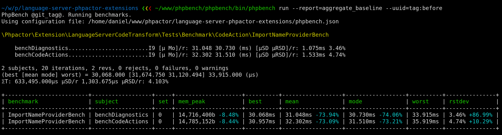

Regression Testing
==================

Sometimes you need to ensure that modifications to existing code do not cause
performance regressions.

PHPBench allows you to store results and use them as a baseline for subsequent
runs.

Run PHPBench on the original code and store the result by specifying a
``--tag``:

.. code-block:: bash

    phpbench run tests/Benchmark/MyBenchmark.php --tag=original

Then switch to the new version of your code and run PHPBench again:

.. code-block:: bash

    phpbench run tests/Benchmark/MyBenchmark.php --report=aggregate --uuid=tag:original

- We use ``--uuid`` to reference the previous, tagged, run, which will merge
  the previous benchmarks into the results.

The final report should look something like:

The ``mean``, ``mode`` and ``rstdev`` columns show the percentage difference
from the previous run.
