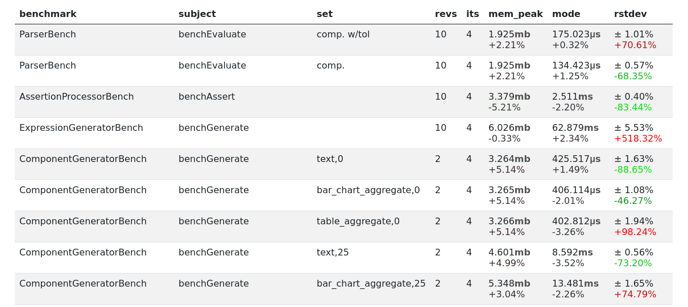

Table Aggregate
===============

Render a table with aggregated data.

   HTML output

Options
-------

.. include:: options/_table_aggregate.rst

Example
-------

Given the following configuration:

.. approved:: ../../examples/Command/report-component-table-aggregate
  :language: bash
  :section: 0

When we run PHPBench with the configured report above:

.. approved:: ../../examples/Command/report-component-table-aggregate
  :language: bash
  :section: 1

Then it generates the following with the ``console`` renderer:

.. approved:: ../../examples/Command/report-component-table-aggregate
  :language: bash
  :section: 2

Advanced Columns
----------------

More advanced behavior can be accessed by passing an object instead
of an expression, specifying a "column processor" ``type``.

``expand``
~~~~~~~~~~

You can "expand" columns dynamically by further partitioning the data frame
with the ``expand`` column processor:

.. approved:: ../../examples/Command/report-component-table-aggregate-expand
  :language: bash
  :section: 0

Above we:

- Use an object as the value of the column definition ``by_iteration`` (the name
  is arbitrary and subsequently not used, it needs only to be unique)
- Specified the ``type`` to be ``expand``
- We group (partition) the data by ``iteration_index``)
- Specify a set of columns

Which would produce:

.. approved:: ../../examples/Command/report-component-table-aggregate-expand
  :language: bash
  :section: 2

Note that:

- The ``partition`` parameter is used by default, overwriting the partition
  from the parent scope. You can rename this using the ``var`` option.
- The ``key`` variable is made available representing the "key" of the
  partition, you can rename this variable with the ``key_var`` option.
